# Dashboard SPPG

> Web-based monitoring dashboard for **nutrition (gizi)** and **production cost** of the
> *Makan Bergizi Gratis* (MBG) national free-meal program, operated per **SPPG** unit
> (*Satuan Pelayanan Pemenuhan Gizi*).


Dashboard SPPG lets an SPPG unit plan daily menus, simulate a menu's nutrition against
**AKG** (Indonesian Recommended Dietary Allowances) targets and its cost against a
per-portion budget, then finalize and monitor the results through dashboards, budget
alerts, and exportable reports.

---

## About This Project

This is a **final-year undergraduate thesis (skripsi)** project for **Informatics
Engineering**. It was formerly named *"Dashboard MBG"* and has been renamed to *Dashboard
SPPG* to reflect the operating unit it models.

The goal is a decision-support tool for the people running an SPPG kitchen: a nutritionist
composes and validates menus, an accountant maintains ingredient prices, and the SPPG head
oversees budgets and program output — all from one role-aware dashboard.

---

## Key Features

| Feature | What it does |
|---|---|
| **Public landing page** | No-auth homepage showing today's finalized menus (with photos) and live current-month stats; includes a contact form. |
| **Menu simulation** | Real-time (no-DB-write) calculation of a menu's nutrition vs. AKG target and cost vs. budget, per target group (`kelompok_sasaran`). |
| **Daily menu lifecycle** | Create a `draft` menu, upload a menu photo, then `finalize` — finalization snapshots ingredient prices and the per-portion budget so historical figures stay stable. |
| **TKPI ingredient database** | ~838 food-composition records (energy, protein, fat, carbs, micronutrients per 100 g BDD), searchable, plus CSV bulk import. |
| **Time-based pricing & budgets** | `HargaBahan` (ingredient price) and `AnggaranPorsi` (per-portion budget) are both effective-dated, so cost calculations use the price/budget valid on the menu's date. |
| **Budget alerts** | Flags finalized menus whose cost is `warning` (≥85%) or `over` (>100%) of budget; navbar badge + dismissible alert list. |
| **Unified dashboard** | Current-month aggregates: average nutrition, cost distribution, budget totals, trends, and % of AKG met. |
| **Reports** | Export cost and nutrition reports to **Excel** and **PDF**. |
| **User management** | Superadmin manages operational accounts and password resets. |

### Roles & access

Roles are stored as a single string on the `users.role` column and enforced by
`RoleMiddleware` (route alias `role:`), which `abort(403)`s on mismatch.

| Area | superadmin | ketua_sppg | ahli_gizi | akuntan |
|---|:---:|:---:|:---:|:---:|
| User management (`/users`) | ✅ | | | |
| Dashboard | | ✅ | ✅ | ✅ |
| Bahan Pangan — view | | ✅ | ✅ | ✅ |
| Bahan Pangan — manage | | ✅ | | |
| Menu Harian — view | | ✅ | ✅ | |
| Menu Harian — manage / simulasi | | | ✅ | |
| Gizi monitoring | | ✅ | ✅ | |
| Biaya / Harga — view | | ✅ | | ✅ |
| Harga Bahan — manage | | | | ✅ |
| Anggaran Porsi | | ✅ | | |
| Import TKPI | | ✅ | | |
| Budget Alert | | ✅ | | ✅ |
| Laporan | | ✅ | ✅ | ✅ |
| Pesan Masuk | | ✅ | | |

---

## Tech Stack

| Layer | Technology |
|---|---|
| Backend | PHP `^8.2`, Laravel `^12.0` |
| Auth scaffolding | `laravel/ui` `^4.6` (custom `LoginController`) |
| Frontend build | Vite `^7` + `laravel-vite-plugin` `^2`, Sass `^1.56` |
| UI | Bootstrap `^5`, Font Awesome, Chart.js *(loaded via CDN)* |
| PDF export | `barryvdh/laravel-dompdf` `^3.1` |
| Excel export | `rap2hpoutre/fast-excel` `^5.7` |
| Database | SQLite (default / tests), MySQL (production) |
| Testing | PHPUnit `^11.5` |
| Code style | Laravel Pint `^1.24` |

> **Note:** `tailwindcss` v4 and `spatie/laravel-permission` are present in the dependency
> manifests but are **not** the active path — Bootstrap is the primary UI framework and
> roles are managed via the `users.role` column, not Spatie. See [Known Limitations](#known-limitations).

---

## Screenshots

| Landing page | Dashboard |
|---|---|
| 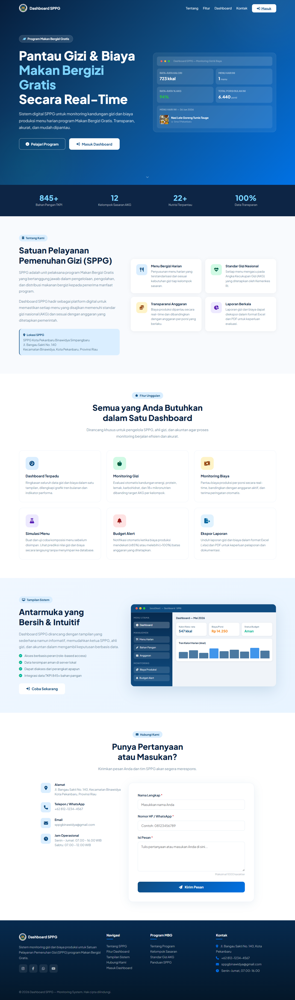 | 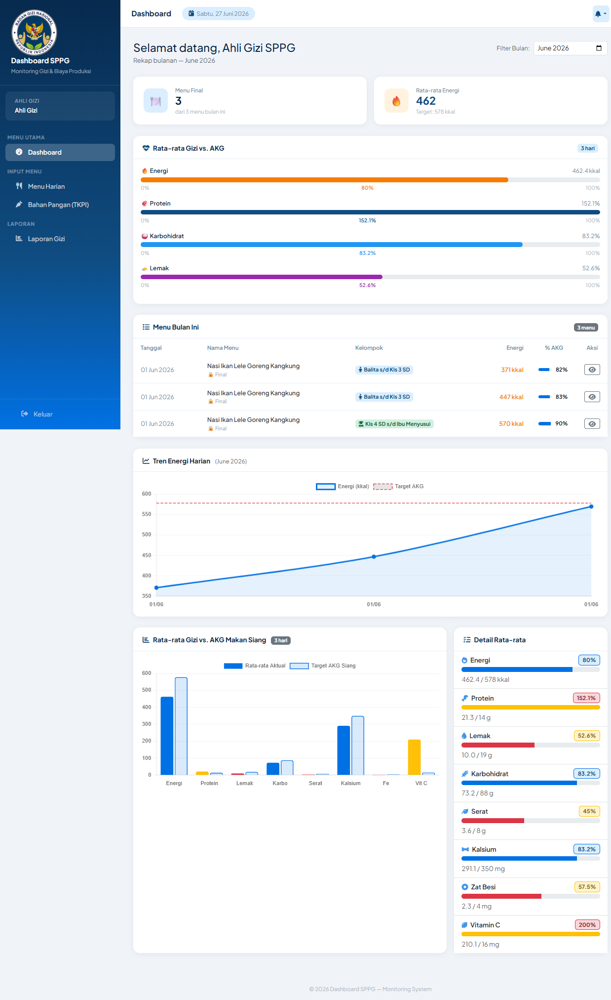 |

**Menu simulation** — nutrition vs. AKG and cost vs. budget in real time:

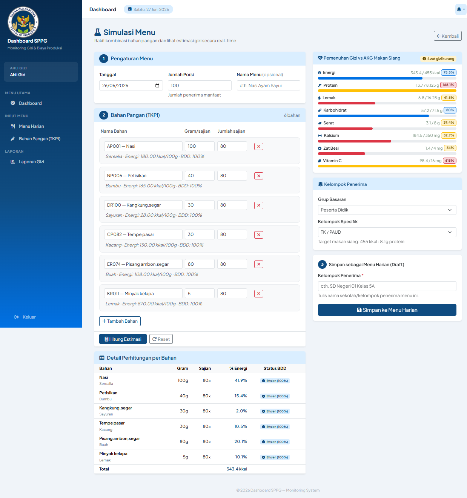

| Daily menu | Budget alerts |
|---|---|
| 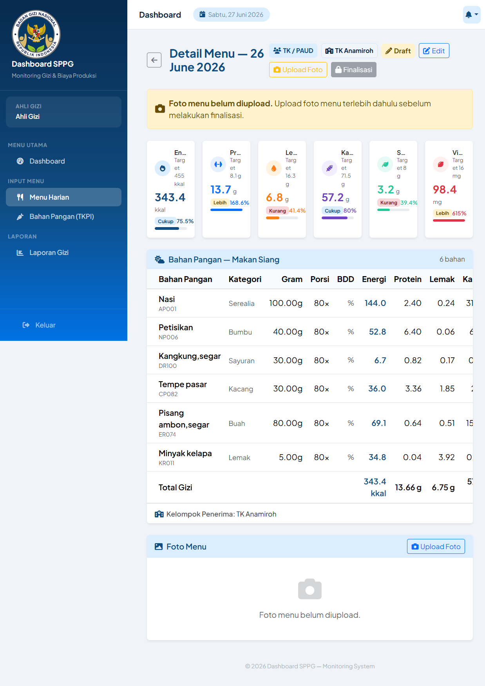 | 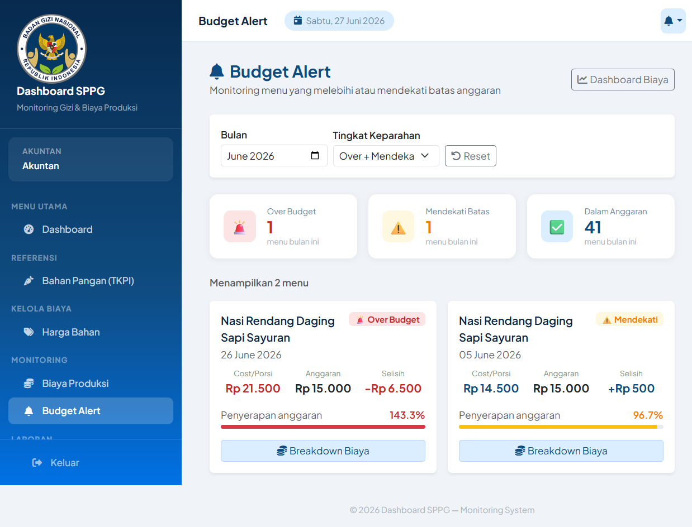 |

<details>
<summary>More screenshots</summary>

| Bahan Pangan (TKPI) | Harga Bahan |
|---|---|
| 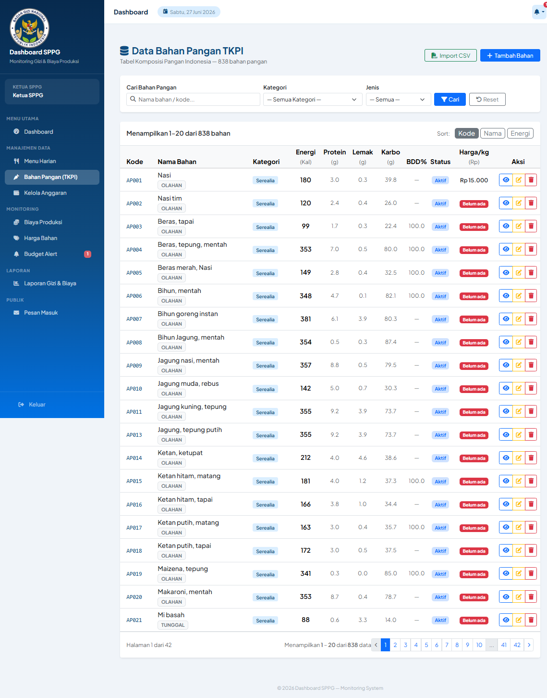 | 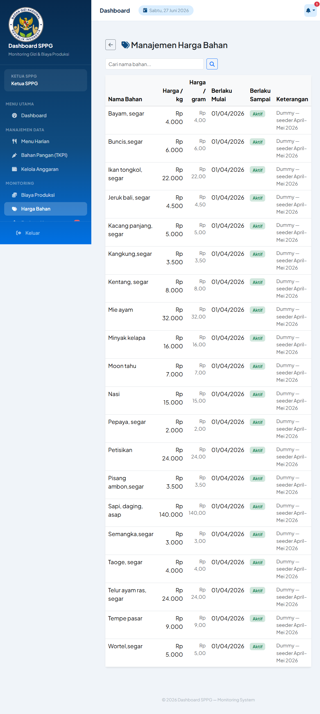 |

| Anggaran Porsi | Laporan |
|---|---|
| 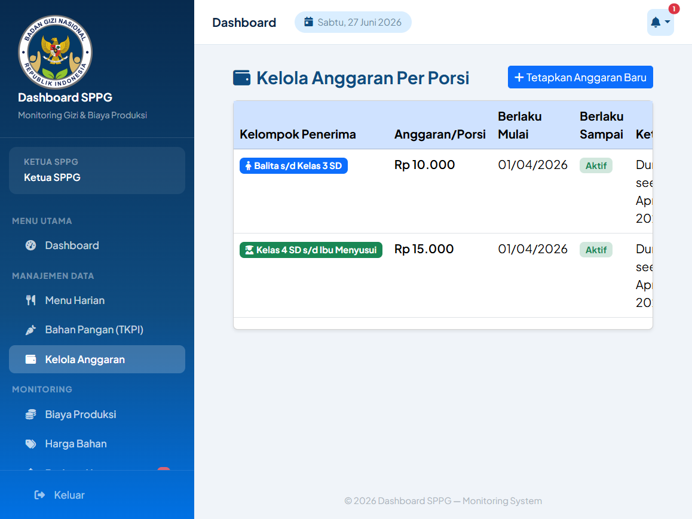 | 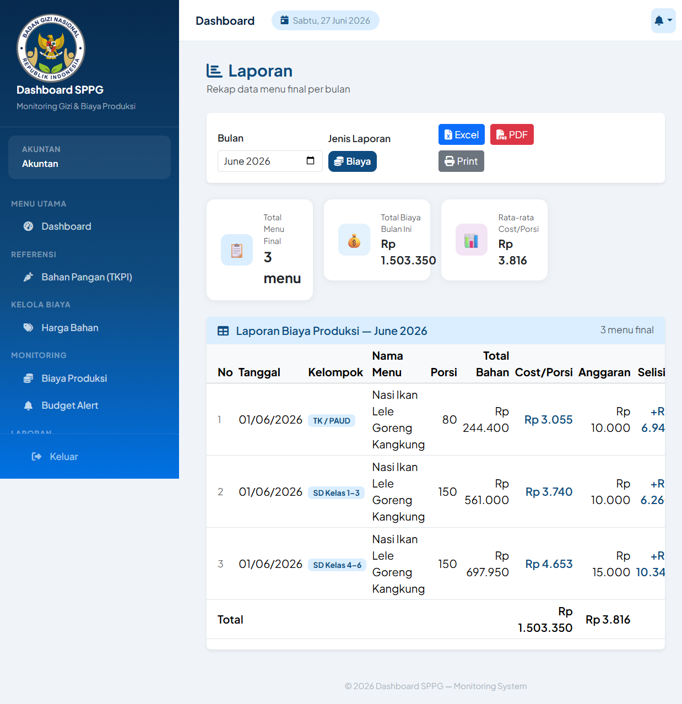 |

| Import TKPI | User management |
|---|---|
| 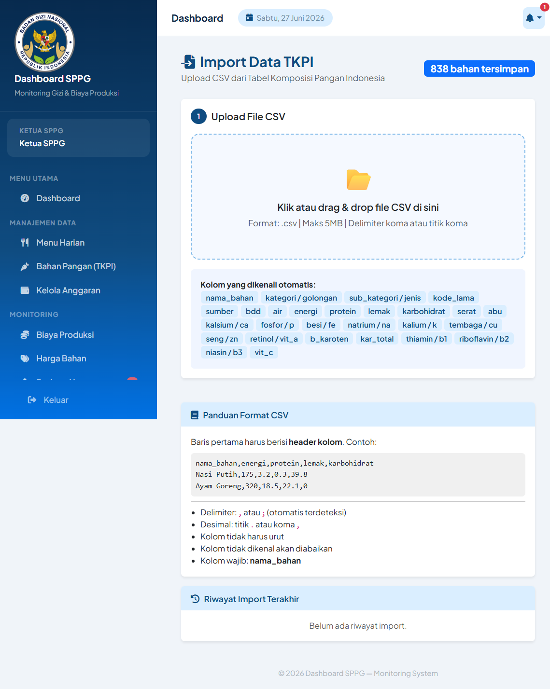 | 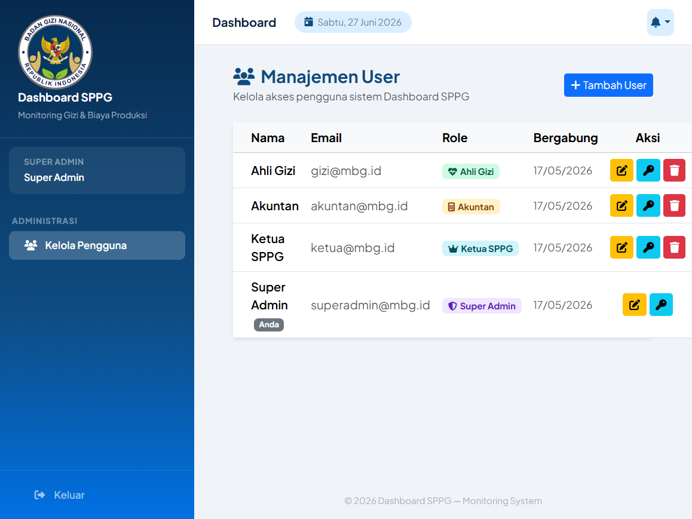 |

Login page:

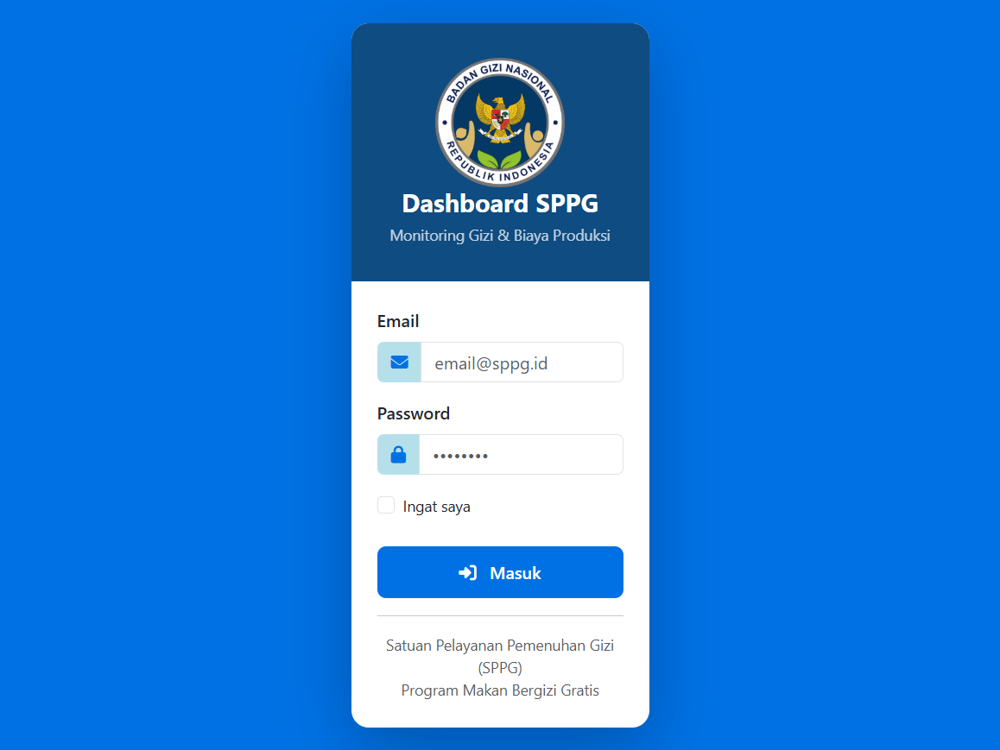

</details>

---

## Requirements

- **PHP** 8.2 or newer (with the standard Laravel extensions)
- **Composer** 2.x
- **Node.js** 18+ and npm
- **SQLite** (default) or **MySQL** for production

## Installation

```bash
# 1. Clone
git clone https://github.com/MohdFarhanS/dashboard_sppg.git
cd dashboard_sppg

# 2. One-shot setup (install deps, copy .env, generate key, migrate, build assets)
composer setup
```

The `composer setup` script runs, in order:
`composer install` → copy `.env.example` to `.env` (if missing) → `php artisan key:generate`
→ `php artisan migrate --force` → `npm install` → `npm run build`.

Prefer to do it manually? The equivalent steps are:

```bash
composer install
cp .env.example .env
php artisan key:generate
php artisan migrate
npm install
npm run build
```

Then create the storage symlink so uploaded menu photos are served correctly (run once):

```bash
php artisan storage:link
```

---

## Environment Configuration

The app ships with a `.env.example`. Copy it to `.env` (done for you by `composer setup`)
and adjust as needed. Defaults are development-friendly and require **no secrets** to run.

Key variables:

| Variable | Default | Purpose |
|---|---|---|
| `DB_CONNECTION` | `sqlite` | Database driver. Switch to `mysql` for production. |
| `UNIT_SPPG` | `"SPPG Utama"` | Display name of the operating SPPG unit (app-specific). |
| `SESSION_DRIVER` | `database` | Session storage. |
| `QUEUE_CONNECTION` | `database` | Queue backend. |
| `MAIL_MAILER` | `log` | Mail transport (logs by default in dev). |

**Using MySQL instead of SQLite:** set `DB_CONNECTION=mysql` and uncomment/fill the
`DB_HOST`, `DB_PORT`, `DB_DATABASE`, `DB_USERNAME`, and `DB_PASSWORD` lines in `.env`,
then run `php artisan migrate`.

---

## Running the Application

Start every dev service at once (Laravel server, queue worker, log tailer, and Vite):

```bash
composer dev
```

This runs `php artisan serve`, `php artisan queue:listen`, `php artisan pail`, and
`npm run dev` concurrently. The app is then available at `http://127.0.0.1:8000`.

Prefer separate terminals:

```bash
php artisan serve   # http://127.0.0.1:8000
npm run dev         # Vite dev server / HMR
```

### Database & seeding

```bash
php artisan migrate            # apply schema
php artisan db:seed            # 4 role accounts + TKPI ingredient data
```

`db:seed` runs `UserSeeder` (accounts below) and `BahanPanganSeeder` (loads TKPI records
from `database/seeders/data/tkpi_seeder.json`). To populate dashboards, charts, and reports
with realistic finalized menus, prices, and budgets, also run the optional dummy seeder:

```bash
php artisan db:seed --class=MenuDummySeeder
```

### Default accounts

Seeded by `UserSeeder`. Password for all: **`password123`** *(development only — change for
any real deployment)*.

| Email | Role | Access summary |
|---|---|---|
| `superadmin@mbg.id` | superadmin | User management only |
| `ketua@mbg.id` | ketua_sppg | Full operational oversight |
| `gizi@mbg.id` | ahli_gizi | Menu input, simulation, nutrition |
| `akuntan@mbg.id` | akuntan | Prices, cost monitoring, budget alerts |

---

## Testing

Tests run against an **in-memory SQLite** database (configured in `phpunit.xml`) — they
never touch your real data.

```bash
composer test                      # clears config cache, then runs the suite
php artisan test                   # run all tests
php artisan test --filter=NutrisiPerPorsiTest   # run one test class
php artisan test tests/Feature/BlackBox         # run the black-box suite
```

The suite includes feature tests plus a **black-box** suite under
`tests/Feature/BlackBox/` (`NutrisiPerPorsiTest`, `BiayaProduksiTest`, `SimulasiMenuTest`,
`BudgetAlertTest`) that exercises the core nutrition and cost business rules by input/output.

---

## Project Structure

```
dashboard-sppg/
├── app/
│   ├── Constants/AKG.php            # AKG targets + per-group (kelompok) tables
│   ├── Http/
│   │   ├── Controllers/             # 14 controllers (incl. Auth/LoginController)
│   │   └── Middleware/RoleMiddleware.php
│   ├── Models/                      # 8 domain models (+ Concerns/PeriodeBerlaku)
│   ├── Providers/AppServiceProvider.php
│   └── Traits/HasUnitScope.php
├── database/
│   ├── migrations/                  # 28 migration files
│   ├── seeders/                     # UserSeeder, BahanPanganSeeder, MenuDummySeeder
│   │   └── data/tkpi_seeder.json    # TKPI food-composition dataset
│   └── factories/
├── docs/
│   ├── screenshots/                 # images used in this README
│   └── AUDIT-CODEBASE-2026-07-23.md
├── resources/
│   ├── views/                       # Blade templates (per feature) + layouts/partials
│   ├── sass/app.scss
│   └── js/app.js
├── routes/
│   ├── web.php                      # all routes (incl. /api/... endpoints)
│   └── console.php
├── tests/
│   ├── Feature/                     # feature tests
│   │   └── BlackBox/                # business-rule black-box tests
│   └── Unit/
├── composer.json
├── package.json
└── vite.config.js
```

**Domain models:** `User`, `BahanPangan`, `MenuHarian`, `MenuDetailBahan`, `HargaBahan`,
`AnggaranPorsi`, `ImportLog`, `PesanMasuk`.

> There is no `routes/api.php` — the app is server-rendered (Blade), and the few JSON
> endpoints it uses for autocomplete and live calculation live under an `/api/...` prefix
> inside `routes/web.php` (still auth- and role-protected).

---

## Known Limitations

These are deliberate scope decisions for a thesis project, documented so nothing here
over-claims:

- **Single SPPG unit (not multi-tenant).** Every operational user carries a `unit_sppg`
  value, but the system currently assumes **one** SPPG unit — most queries do not filter by
  unit. Multi-tenant data isolation is an intentional future extension, not a shipped
  feature. *(Architecture decision recorded in `CLAUDE.md`.)*
- **`spatie/laravel-permission` is installed but unused.** Roles are managed with the plain
  `users.role` string column and `RoleMiddleware`, not Spatie's tables.
- **Tailwind CSS v4 is installed but not the active UI framework.** Bootstrap 5 + Sass is
  the primary styling path; Tailwind is present as a dependency without a config.
- **No design diagrams are shipped in the repo.** The `docs/` folder contains the codebase
  audit note and README screenshots only.

---

## License

Released under the **MIT License**. See [LICENSE](LICENSE).

---

*Dashboard SPPG — undergraduate thesis project, Informatics Engineering.*
